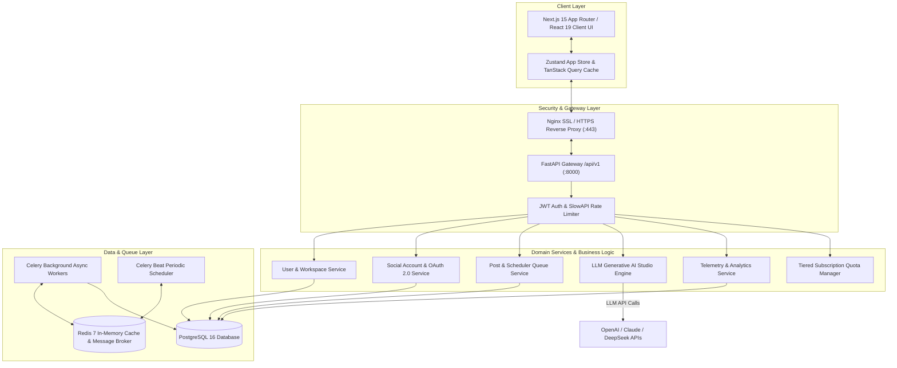
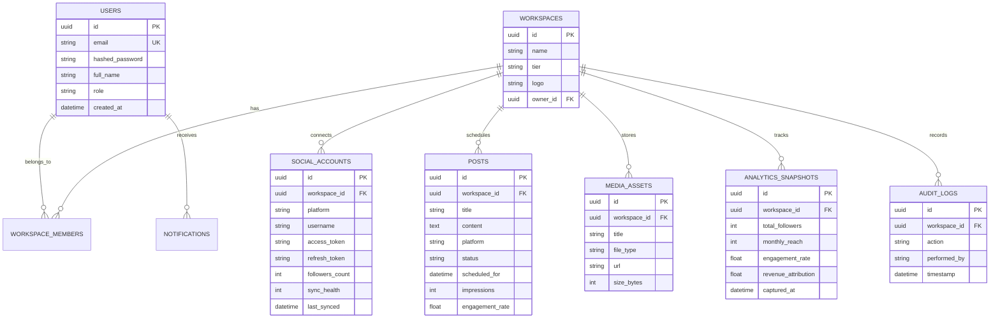

# SocialPulse AI — Enterprise AI-Powered Social Media Analytics Platform

> **Tagline**: AI-Powered Social Media Analytics, Growth Orchestration, and Content Intelligence Operating System.

---

## 🏛️ System Architecture Diagram



---

## 🗄️ Database Entity-Relationship (ER) Diagram



---

## 📡 API Overview & Key Modules

| Module | Canonical Route | HTTP Method | Description |
| :--- | :--- | :---: | :--- |
| **Auth** | `/api/v1/auth/login` | `POST` | OAuth2 Password Grant login & JWT retrieval |
| **Users** | `/api/v1/users/me` | `GET` | Retrieve current authenticated user profile & permissions |
| **Workspaces** | `/api/v1/workspaces` | `GET` | List accessible workspace organizations |
| **Social Accounts** | `/api/v1/social-accounts` | `GET` | List connected accounts & health metrics |
| **OAuth Connect** | `/api/v1/social-accounts/oauth/{platform}/authorize` | `GET` | Generate official OAuth 2.0 authorization URL |
| **Telemetry Sync** | `/api/v1/social-accounts/{id}/sync` | `POST` | Trigger asynchronous social platform data sync |
| **Posts Queue** | `/api/v1/posts/scheduled` | `GET` | List scheduled, published, and draft posts |
| **Create Post** | `/api/v1/posts` | `POST` | Create or schedule multi-platform post |
| **AI Captioning** | `/api/v1/caption/generate` | `POST` | Synthesize brand-tuned AI social media captions |
| **AI Hashtags** | `/api/v1/hashtag/generate` | `/POST` | Generate high-virality hashtag clusters |
| **Sentiment Analysis** | `/api/v1/sentiment/analyze` | `POST` | Perform NLP sentiment & emotion breakdown |
| **Dashboard Overview** | `/api/v1/dashboard/overview` | `GET` | Retrieve live aggregated KPI metric telemetry |
| **Reports Export** | `/api/v1/reports/export` | `POST` | Export executive reports (PDF, CSV, Excel) |
| **WebSockets** | `/api/v1/ws/notifications` | `WS` | Stream live notifications & telemetry updates |
| **Billing & Quotas** | `/api/v1/billing/plans` | `GET` | Retrieve SaaS subscription tiers & usage limits |

---

## 🎬 5–10 Minute Executive Demo Script

### Act 1: Authentication & Workspace Context (1 Minute)
1. **Launch App**: Open `http://localhost:3000`. Observe the luxury metallic gold editorial design system.
2. **Workspace Switcher**: Click the workspace dropdown on the top-left sidebar to toggle between `Pulse Enterprise`, `Acme Global Brand`, and `Personal AI Studio`. Notice instant state synchronization.

### Act 2: Connecting Social Gateways & OAuth (1.5 Minutes)
1. **Navigate**: Click **Social Accounts** in the sidebar navigation.
2. **Inspect Platform Cards**: Review status meters and vector brand logos for Instagram, LinkedIn, X, TikTok, YouTube, Facebook, Threads, and Pinterest.
3. **Trigger Sync**: Click **Sync Now** on the LinkedIn card to execute real-time telemetry synchronization via backend API.

### Act 3: AI Content Studio & LLM Generation (2.5 Minutes)
1. **Navigate**: Click **AI Studio** in the sidebar.
2. **Select LLM Model**: Select `SocialPulse Fine-Tuned v3.5` or `Claude 3.5 Sonnet`.
3. **Adjust Brand Voice**: Adjust the **Sophistication Index** slider to `85%` and **Boldness** to `70%`.
4. **Synthesize Caption**: Enter concept: *"Announcing SocialPulse AI Q3 platform release"* and click **Generate with AI**.
5. **Direct Queue**: Review synthesized output and click **Queue Post** to push directly into the post queue.

### Act 4: Post Scheduler & Queue Management (1.5 Minutes)
1. **Navigate**: Click **Posts & Queue** and **Calendar**.
2. **Inspect Queue**: View posts organized across Month Grid and Agenda list view.
3. **Filter**: Toggle status tabs between `All`, `Scheduled`, `Published`, and `Drafts`.

### Act 5: Executive Analytics & PDF Report Generation (1.5 Minutes)
1. **Navigate**: Click **Dashboard** and **Analytics**.
2. **Review Telemetry**: Observe animated CountUp statistics for **149.8K Followers**, **2.45M Reach**, **5.84% Engagement**, and Recharts area graphs.
3. **Export Report**: Click **Reports**, select **Q3 Executive Performance Brief**, and click **Preview PDF** to trigger executive PDF viewer modal.

---

## 💻 Local Development Setup

### 1. Prerequisites
- Python 3.11+
- Node.js 18+
- PostgreSQL & Redis (or Docker)

### 2. Backend Setup
```bash
cd backend
python -m venv .venv
source .venv/bin/activate  # On Windows: .venv\Scripts\activate
pip install -r requirements.txt
uvicorn app.main:app --reload --port 8000
```
- API Docs: `http://localhost:8000/docs`

### 3. Frontend Setup
```bash
cd frontend
npm install
npm run dev
```
- Web Application: `http://localhost:3000`

---

## 🐳 Production Docker Deployment

To launch the full production stack (Frontend, FastAPI, PostgreSQL, Redis, Celery Worker, Celery Beat, Nginx SSL):

```bash
docker-compose -f docker-compose.prod.yml up -d --build
```

---

## ⚙️ Environment Variables Reference

| Variable | Description | Default / Example |
| :--- | :--- | :--- |
| `NEXT_PUBLIC_API_URL` | Frontend API Base URL | `http://localhost:8000/api/v1` |
| `POSTGRES_SERVER` | Database Server Host | `localhost` / `db` |
| `POSTGRES_USER` | Database User | `postgres` |
| `POSTGRES_PASSWORD` | Database Password | `postgres_secure_pw` |
| `POSTGRES_DB` | Database Name | `socialpulse_db` |
| `REDIS_HOST` | Redis Server Host | `localhost` / `redis` |
| `SECRET_KEY` | JWT Signing Secret | `super-secret-production-key` |
| `SENTRY_DSN` | Sentry Error Tracking DSN | `https://examplePublicKey@o0.ingest.sentry.io/0` |
